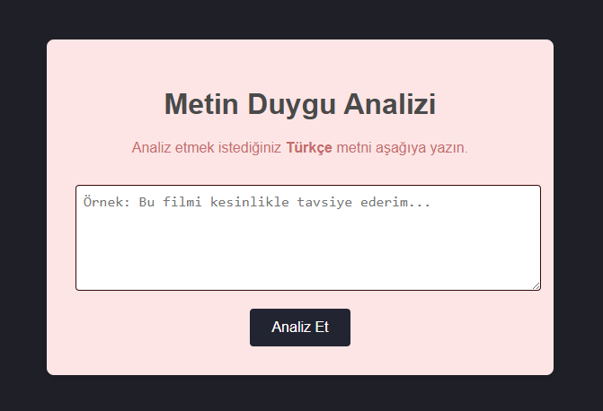
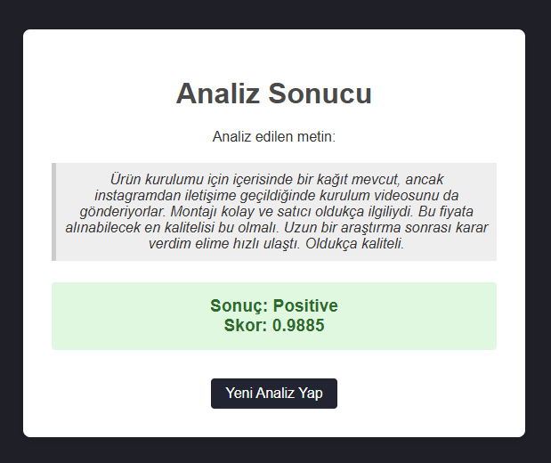

"Bu benim ilk AI projemin baslangicidir." 

-> python pratikleri ile başlayıp, metin duygu analizi yapan bir web uygulaması inşaa ederek bitecek süreci kayıt altında tutmak için bu repo açılmıştır.
##########################################################################

# Türkçe Metin Duygu Analizi Web Uygulaması 💬

Bu proje, kullanıcı tarafından girilen Türkçe metinlerin duygu yoğunluğunu (pozitif, negatif) analiz eden ve sonucu basit, modern bir web arayüzünde sunan bir yapay zeka uygulamasıdır.



---

## 🚀 Temel Özellikler

* **Türkçe Dil Desteği:** Özellikle Türkçe metinler için eğitilmiş `savasy/bert-base-turkish-sentiment-cased` yapay zeka modelini kullanır.
* **Gerçek Zamanlı Analiz:** Girilen metnin duygu skorunu anında hesaplar.
* **Basit ve Kullanışlı Arayüz:** Herkesin kolayca kullanabileceği temiz ve anlaşılır bir web arayüzüne sahiptir.
* **Modern Teknoloji:** Endüstri standardı olan Hugging Face `transformers` kütüphanesi ve Flask web çatısı üzerine kurulmuştur.

---

## 🛠️ Kullanılan Teknolojiler

* **Backend:** Python, Flask
* **Yapay Zeka:** Hugging Face Transformers, PyTorch
* **AI Modeli:** `savasy/bert-base-turkish-sentiment-cased`
* **Frontend:** HTML, CSS
* **Paket Yönetimi:** Pip, Venv

---

## ⚙️ Kurulum ve Çalıştırma

Bu projeyi kendi bilgisayarınızda çalıştırmak için aşağıdaki adımları izleyebilirsiniz:

1.  **Projeyi Klonlayın:**
    ```bash
    git clone [https://github.com/KULLANICI_ADINIZ/AI-Projem.git](https://github.com/KULLANICI_ADINIZ/AI-Projem.git)
    cd AI-Projem
    ```

2.  **Sanal Ortamı Oluşturun ve Aktive Edin:**
    ```bash
    # Sanal ortamı oluştur
    python -m venv venv

    # Windows için aktive etme
    .\venv\Scripts\activate

    # macOS/Linux için aktive etme
    source venv/bin/activate
    ```

3.  **Gerekli Kütüphaneleri Yükleyin:**
    *Proje, ilk çalıştırmada Hugging Face üzerinden model dosyalarını indirecektir.*
    ```bash
    pip install -r requirements.txt
    ```

4.  **Uygulamayı Başlatın:**
    ```bash
    python app.py
    ```

5.  Tarayıcınızda `http://127.0.0.1:5000/` adresini ziyaret edin.

---

## ✨ Örnek Kullanım

Uygulamanın bir ürün yorumunu nasıl doğru bir şekilde analiz ettiğini görelim.

**Girdi Metni:**
> 💬 "Ürün kurulumu için içerisinde bir kağıt mevcut, ancak instagramdan iletişime geçildiğinde kurulum videosunu da gönderiyorlar. Montajı kolay ve satıcı oldukça ilgiliydi. Bu fiyata alınabilecek en kalitelisi bu olmalı. Uzun bir araştırma sonrası karar verdim elime hızlı ulaştı. Oldukça kaliteli."

**Analiz Sonucu:**
Yapay zeka modeli, metindeki olumlu ifadeleri değerlendirerek metnin genel duygu yoğunluğunu yüksek bir skorla **pozitif** olarak belirler.



---

## 📄 Lisans

Bu proje MIT Lisansı ile lisanslanmıştır.
